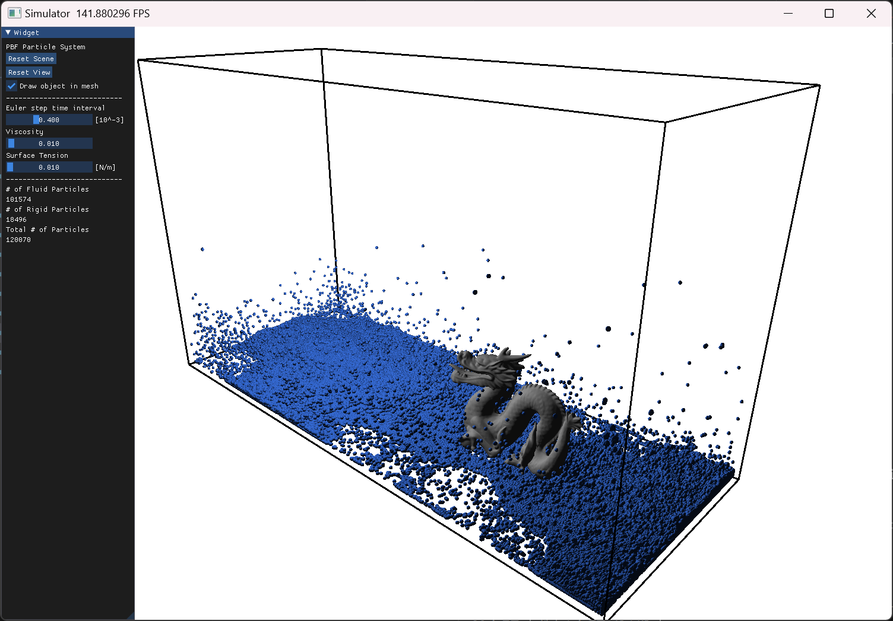

# Real-Time 3D Fluid Simulator

Major project for BCIT Computer Systems Technology Bachelor of Technology (BCIT CST BTech).

## Usage
To setup the environment, use
```bash
pip install -r requirements.txt
```
Run PBF algorithm with GGUI:

```bash
python main.py
```
Run SPH algorithm with GGUI and control panel:

```bash
python run_simulation.py
```

## Gallery

### PBF algorithm


### SPH algorithm


